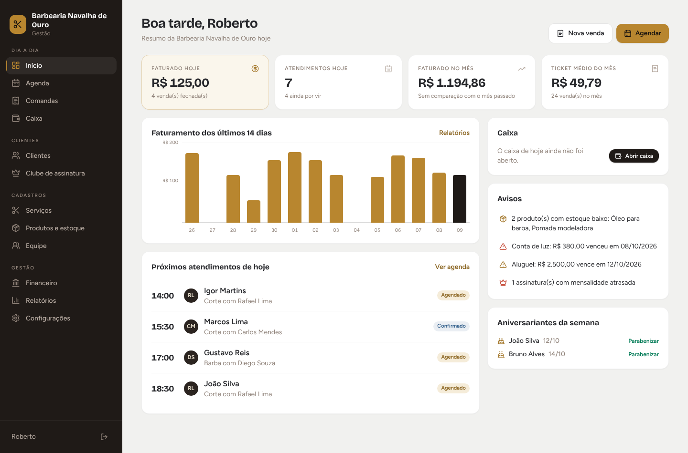
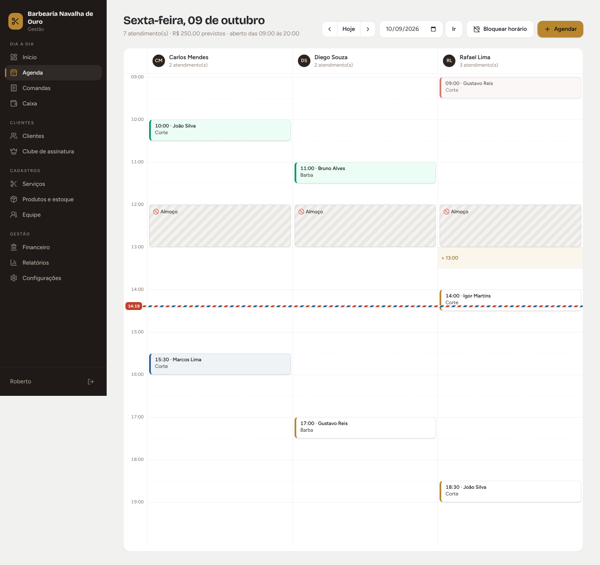
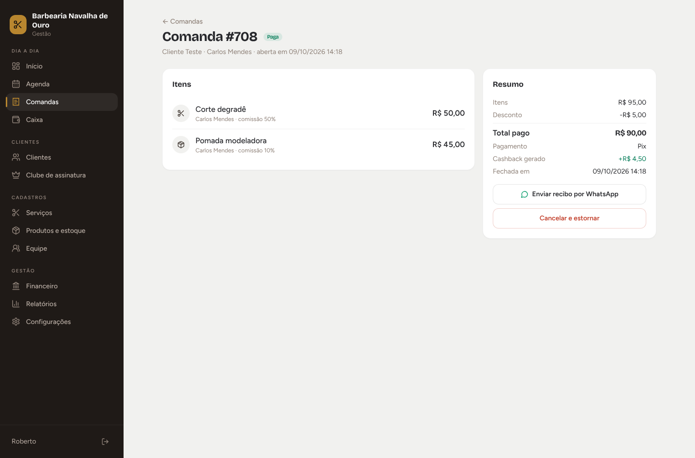
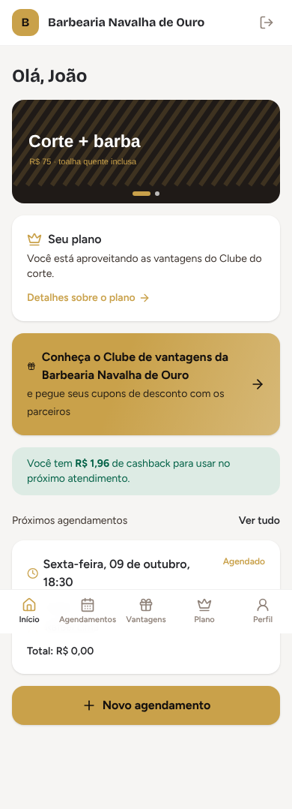

# ✂️ KlarezaBarber

Sistema de agendamento online e gestão para barbearias (no estilo CashBarber).
É **multi-barbearia**: um único sistema atende várias barbearias, cada uma com
o próprio login, os próprios dados e o próprio link de agendamento.

| Início | Agenda | Comanda | Área do cliente |
| --- | --- | --- | --- |
|  |  |  |  |

## Funções

**Dia a dia**
- **Início:** faturamento do dia e do mês (com comparação), gráfico de 14 dias, próximos atendimentos, avisos (estoque baixo, contas vencendo, mensalidades atrasadas) e aniversariantes
- **Agenda em grade:** uma coluna por barbeiro, clique num horário vazio para agendar, encaixe, remarcação, confirmação/lembrete por WhatsApp, falta e cancelamento
- **Lembretes por WhatsApp (sem API, sem custo):** lista de clientes de amanhã, de hoje e dos novos agendamentos pelo site; um botão abre o WhatsApp com a mensagem pronta e marca como enviado. Textos editáveis, com link para o cliente confirmar presença ou cancelar
- **Folgas e bloqueios:** almoço, folga, férias ou feriado (por barbeiro ou da barbearia toda)
- **Comandas:** serviços + produtos, desconto, cashback, forma de pagamento, recibo por WhatsApp e estorno
- **Caixa:** abertura com troco, suprimento, sangria, despesas, totais por forma de pagamento e fechamento com conferência do dinheiro

**Clientes**
- Ficha completa: visitas, total gasto, ticket médio, frequência, serviço preferido, faltas, cashback e histórico
- Filtros: sumidos há 45+ dias, assinantes, com cashback
- **Clube de assinatura:** planos mensais (ilimitados ou com limite de usos), serviços inclusos saem sem cobrança na comanda, controle de mensalidades e cobrança por WhatsApp
- **Cashback:** % do valor pago vira crédito para a próxima visita

**Cadastros**
- **Serviços:** categoria, descrição, foto, duração, comissão específica, quais barbeiros fazem e se aparece online
- **Produtos e estoque:** cadastro único para a rede e estoque separado por unidade (quantidade, mínimo, entradas, contagem, transferência entre unidades e histórico)
- **Equipe:** foto, comissão de serviços e de produtos, e login próprio do barbeiro (vê só a agenda, as comandas e as comissões dele)

**Gestão**
- **Unidades (filiais):** cada unidade tem endereço, horário, equipe, agenda e caixa próprios; clientes, serviços, planos, banners e parceiros valem em todas. Seletor de unidade no menu (ou "Todas as unidades") e relatório comparando as unidades
- **Financeiro:** contas a pagar (com recorrência), resultado do mês (entradas − comissões − despesas)
- **Relatórios:** faturamento por dia, comissões por barbeiro, serviços e produtos mais vendidos, formas de pagamento, % de agendamento online e de faltas
- **Configurações:** logo, foto de capa, cor da marca, apresentação, Instagram, horários, intervalo, antecedência, prazo de cancelamento e cashback

**Página e área do cliente** (`/b/<barbearia>`)
- Página da barbearia: capa, logo, banners, profissionais (com selo de destaque), serviços, planos, horários, mapa, WhatsApp e Instagram
- Agendamento em etapas: filial (quando há mais de uma) → profissional → serviços (pode escolher vários de uma vez) → horário, com o total e a duração no rodapé
- **Área do cliente** com login (WhatsApp + senha): início com banners, "Seu plano", clube de vantagens e próximos agendamentos; agendamentos (agendados e anteriores); plano; perfil
- Assinante vê os serviços do plano como "No seu plano" (R$ 0,00)
- **Clube de vantagens:** parceiros com cupons de desconto, gerenciados no painel em "Página do cliente"
- Salvar o horário na agenda do celular e cancelar pelo site (respeitando o prazo da barbearia)

## Planos do KlarezaBarber

| Plano | Mensal | Anual | Unidades | Assinantes ativos no clube |
| --- | --- | --- | --- | --- |
| Bairro | R$ 200 | R$ 2.000 | 1 | até 300 |
| Cidade | R$ 400 | R$ 4.000 | 2 | até 500 |
| Nacional | R$ 700 | R$ 7.000 | ilimitadas | ilimitados |

Preços e limites ficam em `src/lib/planosSistema.ts`. Os limites são aplicados ao cadastrar
unidade e assinante. Em `/admin` você define o plano de cada barbearia, registra pagamentos,
acompanha a receita e suspende o acesso de quem não pagou. A página `/planos` mostra os planos
para quem quiser contratar.

## Pagamentos online (Asaas com subcontas)

Cada barbearia abre, pelo painel em **Pagamentos online**, uma subconta do Asaas em nome dela
(envia documento e selfie pelo link que aparece). Depois de aprovada, liga a cobrança online:

- O cliente assina o clube pela área dele e paga por Pix, cartão ou boleto; a mensalidade é
  cobrada todo mês e o plano renova sozinho (webhook `/api/asaas/webhook`).
- No painel, o dono pode criar a assinatura online para quem assina no balcão e mandar o link
  de pagamento pelo WhatsApp.
- O dinheiro cai na conta Asaas da barbearia. Em `/admin` você define uma taxa sua (%) que vai
  por split para a sua conta principal (0 = sem taxa).
- Em `/admin` também dá para cobrar o próprio plano do KlarezaBarber pelo Asaas; o pagamento
  renova o acesso da barbearia sozinho.

Taxas iniciais do Asaas: Pix 1,99% + R$ 1,99; cartão 3,99% + R$ 1,99.

Para ligar: crie a conta principal no Asaas, peça ao comercial a liberação de **subcontas**,
cadastre `ASAAS_API_KEY` (e `ASAAS_AMBIENTE=producao` fora do sandbox) na Vercel e, em `/admin`,
clique em **Ativar** na seção Asaas.

## Tecnologias

Next.js 15 (React 19) · TypeScript · Tailwind CSS 4 · Prisma · PostgreSQL (Supabase) · hospedagem na Vercel

## Colocando no ar (Supabase + Vercel)

Leva uns 15 minutos. Você só precisa de uma conta no GitHub (que já tem).

### 1. Banco de dados no Supabase

1. Crie uma conta em https://supabase.com (pode entrar com o GitHub)
2. Clique em **New project**
   - **Name:** `sistema-barbearia`
   - **Database Password:** clique em *Generate a password* e **guarde essa senha**
   - **Region:** *South America (São Paulo)* (se escolher outra, ajuste `regions` no `vercel.json`
     para a região da Vercel mais próxima, ex.: `pdx1` para `us-west-2`)
3. Com o projeto criado, clique em **Connect** (no topo) → aba **ORMs** → **Prisma**.
   Aparecem duas linhas: `DATABASE_URL` (porta 6543) e `DIRECT_URL` (porta 5432).
   Copie as duas e troque `[YOUR-PASSWORD]` pela senha do passo anterior.

### 2. Site na Vercel

1. Crie uma conta em https://vercel.com usando **Continue with GitHub**
2. Clique em **Add New… → Project**, escolha o repositório `sistema-barbearia` e clique em **Import**
3. Em **Environment Variables**, adicione as 4 variáveis:

   | Nome | Valor |
   | --- | --- |
   | `DATABASE_URL` | a linha da porta **6543** copiada do Supabase |
   | `DIRECT_URL` | a linha da porta **5432** copiada do Supabase |
   | `AUTH_SECRET` | uma sequência aleatória longa (ex.: gere em https://generate-secret.vercel.app/32) |
   | `ADMIN_SENHA` | uma senha forte, só sua, para a área de administração |
   | `ASAAS_API_KEY` | (opcional) chave da sua conta Asaas, para pagamentos online |
   | `ASAAS_AMBIENTE` | (opcional) `sandbox` para testes ou `producao` |

4. Clique em **Deploy**. A Vercel instala tudo, **cria as tabelas no Supabase sozinha** e
   publica o site num endereço como `https://sistema-barbearia.vercel.app`.

> Se o projeto for importado de um branch que não é o `main`, ajuste em
> **Settings → Git → Production Branch**, ou faça o merge para o `main` antes.

### 3. Cadastrando as barbearias clientes

1. Acesse `https://SEU-SITE.vercel.app/admin` e entre com a `ADMIN_SENHA`
2. Cadastre cada barbearia (nome, dono, e-mail e senha inicial)
3. Passe para o dono o endereço `/login` com o e-mail e a senha. Ele cadastra os barbeiros e
   serviços e ajusta o horário de funcionamento em **Configurações**
4. Divulgue o link de agendamento `/b/<link-da-barbearia>` (bio do Instagram, WhatsApp,
   Google Meu Negócio)

Na mesma página `/admin` dá para ver todas as barbearias e redefinir a senha de um dono.

### Domínio próprio (opcional)

Na Vercel, **Settings → Domains** permite usar um domínio seu (ex.: `agendabarber.com.br`,
registrado no https://registro.br por cerca de R$ 40/ano).

### Custos

- **Supabase:** gratuito até 500 MB de banco (sobra para várias barbearias). No plano
  gratuito, o projeto é pausado após 7 dias **sem nenhum acesso**; com as barbearias
  usando todo dia, isso não acontece.
- **Vercel:** o plano gratuito (Hobby) serve para testar, mas pelos termos da Vercel é
  só para uso **não comercial**. Quando começar a cobrar das barbearias, passe para o
  plano **Pro** (US$ 20/mês).

## Rodando no seu computador (para desenvolver)

Precisa do [Node.js](https://nodejs.org) 20+ e de um PostgreSQL (pode usar um segundo
projeto gratuito do Supabase só para testes).

```bash
npm install
cp .env.example .env          # preencha com os dados do seu banco de testes
npx prisma migrate dev        # cria as tabelas
npm run db:seed               # (opcional) cria 2 barbearias de demonstração
npm run dev
```

Abra http://localhost:3000. Logins da demonstração (senha `123456`):
`dono@navalha.com` (`/b/navalha-de-ouro`), `dono@corteforte.com` (`/b/corte-forte`) e o barbeiro `carlos@navalha.com`.
Área do cliente: `/b/navalha-de-ouro/entrar` com o WhatsApp `11987654321` e a senha `123456`.

Também dá para cadastrar barbearias pelo terminal com `npm run criar-barbearia`.

## Próximas etapas sugeridas

- [ ] Envio automático dos lembretes (precisaria de uma API de WhatsApp paga)
- [ ] Cobrança automática das assinaturas no cartão/Pix (precisa de conta no Mercado Pago ou Asaas)
- [ ] Emissão de nota fiscal de serviço (NFS-e)
- [ ] Pacotes de serviços pré-pagos e vale-presente
- [ ] Controle das mensalidades das barbearias clientes na área /admin
