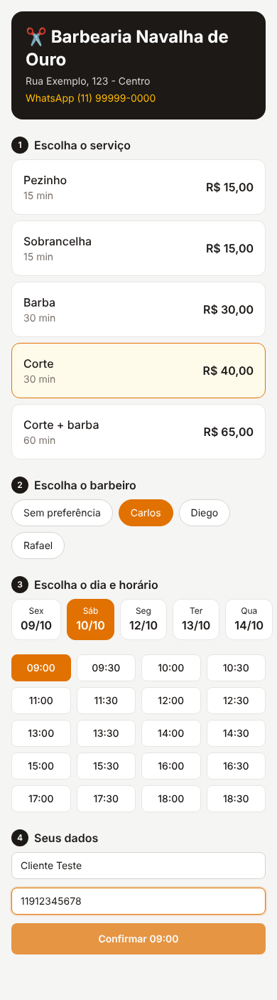
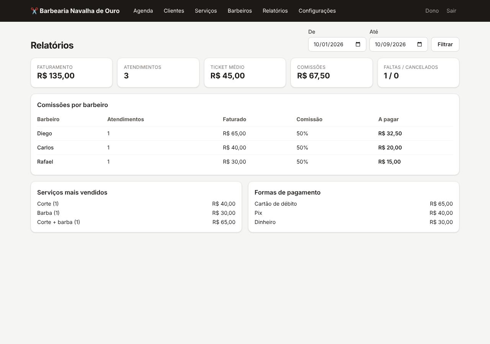

# ✂️ Sistema Barbearia

Sistema de agendamento online e gestão para barbearias (no estilo CashBarber).
É **multi-barbearia**: um único sistema atende várias barbearias, cada uma com
o próprio login, os próprios dados e o próprio link de agendamento.

| Cliente agendando pelo celular | Agenda do dia | Relatórios e comissões |
| --- | --- | --- |
|  |  |  |

## O que já funciona (MVP)

**Página pública de agendamento** — `/b/<nome-da-barbearia>`
- O cliente escolhe o serviço, o barbeiro (ou "sem preferência"), o dia e o horário livre
- Informa nome e WhatsApp; o cadastro do cliente é criado automaticamente
- Só mostra horários realmente livres (respeita a duração do serviço e o horário de funcionamento)
- Proteção contra dois clientes reservarem o mesmo horário ao mesmo tempo

**Painel da barbearia** — `/login`
- **Agenda:** visão do dia por barbeiro, com faturamento do dia, ações de concluir (com forma de pagamento), faltou, cancelar e botão de WhatsApp para confirmar com o cliente
- **Novo agendamento** pelo balcão, com opção de encaixe
- **Clientes:** busca, histórico de atendimentos, total gasto e última visita
- **Serviços:** preço e duração
- **Barbeiros:** com percentual de comissão
- **Relatórios:** faturamento, ticket médio, comissão a pagar por barbeiro, serviços mais vendidos e formas de pagamento
- **Configurações:** dados da barbearia, horário de funcionamento por dia da semana, intervalo entre horários e até quantos dias à frente o cliente pode agendar

## Tecnologias

Next.js 15 (React 19) · TypeScript · Tailwind CSS 4 · Prisma · SQLite (em produção, PostgreSQL)

## Rodando no seu computador

Precisa do [Node.js](https://nodejs.org) 20 ou mais novo.

```bash
npm install
cp .env.example .env          # e troque o AUTH_SECRET por uma chave aleatória
npx prisma migrate dev        # cria o banco de dados
npm run db:seed               # (opcional) cria 2 barbearias de demonstração
npm run dev
```

Abra http://localhost:3000. Logins da demonstração (senha `123456`):
- `dono@navalha.com` → página pública `/b/navalha-de-ouro`
- `dono@corteforte.com` → página pública `/b/corte-forte`

## Cadastrando uma barbearia cliente

```bash
npm run criar-barbearia
```

O script pergunta o nome da barbearia, o link, o nome do dono, o e-mail e a senha.
Depois disso, o dono entra no painel e cadastra os barbeiros e serviços. Por fim,
basta divulgar o link `/b/<link>` (Instagram, WhatsApp, Google Meu Negócio).

## Colocando no ar

A forma mais simples e barata é a **Vercel** (hospedagem) com um banco **PostgreSQL**
gratuito da [Neon](https://neon.tech) ou do [Supabase](https://supabase.com):

1. Em `prisma/schema.prisma`, troque `provider = "sqlite"` por `provider = "postgresql"`
2. Apague a pasta `prisma/migrations` e rode `npx prisma migrate dev --name inicial`
   com o `DATABASE_URL` do PostgreSQL
3. Na Vercel, importe o repositório e configure as variáveis `DATABASE_URL` e `AUTH_SECRET`
4. Rode `npm run criar-barbearia` apontando para o banco de produção

> Alternativa: manter o SQLite num servidor com disco persistente (VPS, Railway ou
> Render com volume). Nesse caso, faça backup do arquivo do banco regularmente.

## Próximas etapas sugeridas

- [ ] Lembretes automáticos por WhatsApp (1 dia antes / 2 horas antes)
- [ ] Cliente cancelar ou remarcar pelo link
- [ ] Folgas e horários individuais por barbeiro (bloqueio de agenda)
- [ ] Comanda com venda de produtos e controle de estoque
- [ ] Caixa (abertura/fechamento) e contas a pagar
- [ ] Planos de assinatura (ex.: corte ilimitado mensal) com cobrança recorrente via Pix/cartão
- [ ] Programa de fidelidade / cashback
- [ ] Login individual para cada barbeiro ver a própria agenda e comissão
- [ ] Painel "super admin" para você gerenciar as barbearias clientes e mensalidades
